# StreamFlix (StreamingApp) — End-to-End DevOps Pipeline

**Containerization → CI/CD → Kubernetes on AWS EKS → Monitoring, Logging & ChatOps**

This repository documents the complete DevOps implementation for **StreamingApp**, a MERN-based multi-service streaming application. The app was containerized, pushed through a Jenkins CI/CD pipeline to Amazon ECR, deployed to a production-style Kubernetes cluster on Amazon EKS using Helm, and instrumented with CloudWatch monitoring/logging and SNS-based deployment notifications.

> **Original app:** [github.com/UnpredictablePrashant/StreamingApp](https://github.com/UnpredictablePrashant/StreamingApp)
> **This fork:** [github.com/shiwanshu97/StreamingApp](https://github.com/shiwanshu97/StreamingApp) — branch `feature/devops`

---

## Table of Contents

1. [Project Overview](#1-project-overview)
2. [System Architecture](#2-system-architecture)
3. [Repository Structure](#3-repository-structure)
4. [Step 1 — Version Control with Git](#step-1--version-control-with-git)
5. [Step 2 — Containerize the Application](#step-2--containerize-the-application)
6. [Step 2 (contd.) — Local Kubernetes Validation with Kind & Helm](#step-2-contd--local-kubernetes-validation-with-kind--helm)
7. [Step 3 — AWS Environment Setup](#step-3--aws-environment-setup)
8. [Step 2b — Push Images to Amazon ECR](#step-2b--push-images-to-amazon-ecr)
9. [Step 4 — Continuous Integration with Jenkins](#step-4--continuous-integration-with-jenkins)
10. [Step 5 — Kubernetes Deployment on Amazon EKS](#step-5--kubernetes-deployment-on-amazon-eks)
11. [Step 6 — Monitoring & Logging with CloudWatch](#step-6--monitoring--logging-with-cloudwatch)
12. [Step 8 — Scaling & Final Validation](#step-8--scaling--final-validation)
13. [Step 9 (Bonus) — ChatOps with Amazon SNS](#step-9-bonus--chatops-with-amazon-sns)
14. [Issue Faced & Resolution](#14-issue-faced--resolution)
15. [Useful Command Reference](#15-useful-command-reference)
16. [Validation Checklist](#16-validation-checklist)
17. [Conclusion](#17-conclusion)

---

## 1. Project Overview

StreamingApp is a MERN-based streaming platform made up of one frontend and four independent backend microservices, all backed by MongoDB. The goal of this project was to take the application from "runs on my laptop" to a fully automated, cloud-native deployment:

```
Local Docker  →  Local Kubernetes (Kind)  →  Amazon ECR  →  Jenkins CI/CD
      →  Amazon EKS  →  CloudWatch Monitoring & Logging  →  SNS Alerts
```

Every stage below was built, tested, and verified — locally first (fast feedback loop, no cloud cost), then again for real on AWS. Screenshots of each verification step are embedded throughout this document as proof of execution.

---

## 2. System Architecture

### 2.1 Application Components

| Component | Description | Port | Kubernetes Service Type |
|---|---|---:|---|
| **Frontend** | React app, built and served via Nginx (multi-stage Docker build) | 80 | `NodePort` |
| **Auth Service** | Node.js/Express — user authentication | 3001 | `ClusterIP` |
| **Streaming Service** | Node.js/Express — video streaming logic | 3002 | `ClusterIP` |
| **Admin Service** | Node.js/Express — admin operations | 3003 | `ClusterIP` |
| **Chat Service** | Node.js/Express — chat functionality | 3004 | `ClusterIP` |
| **MongoDB** | Application database | 27017 | `ClusterIP` |

### 2.2 Local Architecture (Docker Compose / Kind)

```
                         ┌─────────────────────┐
                         │      Frontend        │
                         │   Port 3000 / 80      │
                         └──────────┬───────────┘
                                    │
              ┌─────────────────────┼─────────────────────┐
              │                     │                     │
              ▼                     ▼                     ▼
       ┌─────────────┐       ┌─────────────┐      ┌─────────────┐
       │    Auth     │       │  Streaming  │      │    Admin    │
       │    :3001    │       │    :3002    │      │    :3003    │
       └──────┬──────┘       └──────┬──────┘      └──────┬──────┘
              │                     │                     │
              └─────────────────────┼─────────────────────┘
                                    │
                              ┌─────▼─────┐
                              │  MongoDB  │
                              │   :27017  │
                              └─────▲─────┘
                                    │
                              ┌─────┴─────┐
                              │    Chat    │
                              │   :3004    │
                              └───────────┘
```

### 2.3 Final Production Architecture (AWS)

```
Developer
   │  git push
   ▼
GitHub (feature/devops)
   │  Webhook
   ▼
Jenkins (EC2)
   ├── Checkout source
   ├── Build 5 Docker images
   ├── Authenticate with Amazon ECR
   ├── Tag images (Jenkins BUILD_NUMBER)
   ├── Push images to ECR
   ├── Configure EKS access (aws eks update-kubeconfig)
   ├── helm upgrade --install
   ├── Verify Kubernetes rollout
   └── Publish SNS notification (success/failure)
   │
   ▼
Amazon ECR ───────────────► Amazon EKS Cluster (streamingapp-eks)
                                 ├── Frontend   (3 replicas, NodePort :30200)
                                 ├── Auth
                                 ├── Streaming
                                 ├── Admin
                                 ├── Chat
                                 └── MongoDB
                                        │
                     ┌──────────────────┼──────────────────┐
                     ▼                                      ▼
           CloudWatch Container Insights            Amazon SNS
           (metrics, logs, alarms)                  (email notifications)
```

### 2.4 CI/CD Pipeline Flow

```
GitHub Push → GitHub Webhook → Jenkins → Docker Build → ECR Push
   → EKS Access → Helm Deploy → Kubernetes Rollout → SNS Notification
```

### 2.5 Monitoring & Logging Flow

```
EKS Pods
   ├── CloudWatch Agent  →  CloudWatch Metrics  ─┐
   └── Fluent Bit        →  CloudWatch Logs     ─┤
                                                   ▼
                                    CloudWatch Container Insights
                                                   │
                                                   ▼
                                          CloudWatch Alarm (CPU > 80%)
```

---

## 3. Repository Structure

```
StreamingApp/
├── backend/
│   ├── adminService/
│   ├── authService/
│   ├── chatService/
│   └── streamingService/
├── frontend/
├── dockerfiles/
│   ├── admin.Dockerfile
│   ├── auth.Dockerfile
│   ├── chat.Dockerfile
│   ├── frontend.Dockerfile
│   └── streaming.Dockerfile
├── helm/
│   └── streamingapp/
│       ├── Chart.yaml
│       ├── values.yaml
│       └── templates/
│           ├── admin-deployment.yaml
│           ├── admin-service.yaml
│           ├── auth-deployment.yaml
│           ├── auth-service.yaml
│           ├── chat-deployment.yaml
│           ├── chat-service.yaml
│           ├── frontend-deployment.yaml
│           ├── frontend-service.yaml
│           ├── mongo-deployment.yaml
│           ├── mongo-service.yaml
│           ├── streaming-deployment.yaml
│           └── streaming-service.yaml
├── jenkins/                # Jenkinsfile & pipeline configuration
├── scripts/                # Helper shell scripts
├── docs/                   # Additional documentation
├── Images/                 # Proof-of-execution screenshots (this README)
├── docker-compose.yaml
└── README.md
```

---

## Step 1 — Version Control with Git

**Goal:** Fork the base repo and keep it in sync with upstream.

1. Forked [`UnpredictablePrashant/StreamingApp`](https://github.com/UnpredictablePrashant/StreamingApp) into my own account: [`shiwanshu97/StreamingApp`](https://github.com/shiwanshu97/StreamingApp).
2. All DevOps work is done on a dedicated branch, `feature/devops`, keeping it separate from `main`.
3. Cloned the fork locally and added the original repo as an `upstream` remote so new upstream changes can always be pulled in:

```bash
git clone https://github.com/shiwanshu97/StreamingApp.git
cd StreamingApp

# Point at the original repo to stay in sync
git remote add upstream https://github.com/UnpredictablePrashant/StreamingApp.git
git remote -v
```

To pull future upstream updates into the fork:

```bash
git fetch upstream
git checkout main
git merge upstream/main
git push origin main
```

---

## Step 2 — Containerize the Application

**Goal:** Write a Dockerfile per component so every service can be built and run as an independent container.

Dockerfiles live in their own `dockerfiles/` folder (kept separate from application source):

```
dockerfiles/
├── frontend.Dockerfile
├── auth.Dockerfile
├── streaming.Dockerfile
├── admin.Dockerfile
└── chat.Dockerfile
```

**Backend services** (`auth`, `streaming`, `admin`, `chat`) all follow the same pattern, using a lightweight Node.js Alpine base image:

1. Use `node:18-alpine` as the base image.
2. Set `/app` as the working directory.
3. Copy `package.json` and install production dependencies only.
4. Copy the service source code.
5. Expose the service's port (3001 / 3002 / 3003 / 3004).
6. Start the service with `npm start`.

**Frontend** uses a **multi-stage build** to keep the final image small:

```
Node.js build stage → npm ci && npm run build → React production build
        → copied into an Nginx Alpine image → served on port 80
```

Images were built and verified locally before anything touched AWS:

```bash
docker build -f dockerfiles/frontend.Dockerfile  -t streamingapp-frontend:test  .
docker build -f dockerfiles/auth.Dockerfile       -t streamingapp-auth:test      .
docker build -f dockerfiles/streaming.Dockerfile  -t streamingapp-streaming:test .
docker build -f dockerfiles/admin.Dockerfile      -t streamingapp-admin:test     .
docker build -f dockerfiles/chat.Dockerfile       -t streamingapp-chat:test      .

docker images | grep streamingapp
```

A `docker-compose.yaml` ties all six services (5 app services + MongoDB) together for local development, on a shared network with a persistent volume for MongoDB data.

**Local Docker Compose validation:**

```bash
docker compose -f docker-compose.yaml config      # validate the compose file
docker compose -f docker-compose.yaml up -d        # start everything
docker compose -f docker-compose.yaml ps            # confirm all services are "Up"
```

Backend health checks, run directly against the containers:

```bash
curl http://localhost:3001/health   # Auth
curl http://localhost:3002/api/health   # Streaming
curl http://localhost:3003/api/health   # Admin
curl http://localhost:3004/api/health   # Chat
```

All returned a healthy `200 OK` / `{"status":"OK"}` style response, and the frontend loaded successfully at `http://localhost:3000`.

**📸 Proof:**

| # | Screenshot | What it shows |
|---|---|---|
| 1 | `Images/1.FrontEnd & BackEnd-Services-Images-On-Local.png` | All five Docker images built locally |
| 4 | `Images/4.HealthCheckResults.png` | Backend `/health` endpoints returning healthy responses |
| 5 | `Images/5.FrontEnd-UI-On-LocalHost.png` | Frontend UI loading at `localhost:3000` |


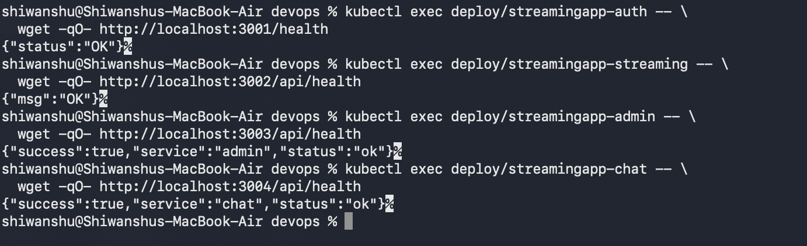


---

## Step 2 (contd.) — Local Kubernetes Validation with Kind & Helm

Before spending any AWS budget, the entire Kubernetes deployment was proven out locally using **Kind** (Kubernetes-in-Docker) and **Helm**. This is what "shift-left" testing looks like in practice — catch config mistakes on a laptop, not on a live EKS bill.

**1. Install & verify Kind:**

```bash
brew install kind
kind version        # kind v0.33.0
```

**2. Create a local cluster:**

```bash
kind create cluster --name streamingapp
kind get clusters                 # → streamingapp
kubectl cluster-info
kubectl get nodes                 # control-plane node: Ready
```

**3. Load the locally built images into the Kind cluster** (Kind can't pull from Docker Hub for locally-tagged images, so they're loaded directly):

```bash
kind load docker-image streamingapp-auth:test      --name streamingapp
kind load docker-image streamingapp-streaming:test --name streamingapp
kind load docker-image streamingapp-admin:test      --name streamingapp
kind load docker-image streamingapp-chat:test       --name streamingapp
kind load docker-image streamingapp-frontend:test   --name streamingapp
```

**4. Build the Helm chart** at `helm/streamingapp/`, containing 6 Deployments + 6 Services (frontend, auth, streaming, admin, chat, mongo). Validate the templates render correctly before installing anything:

```bash
helm template streamingapp ./helm/streamingapp
helm lint ./helm/streamingapp
```

**5. Install the chart:**

```bash
helm install streamingapp ./helm/streamingapp
# STATUS: deployed | REVISION: 1
```

**6. Verify everything came up:**

```bash
kubectl get pods       # all 6 pods → 1/1 Running
kubectl get svc         # all 6 services created
```

**7. Access the frontend.** Kind's NodePort networking is awkward on macOS, so the frontend was reached via port-forwarding:

```bash
kubectl port-forward service/streamingapp-frontend 3000:80
# → http://localhost:3000
```

**8. Backend health check from inside the cluster:**

```bash
kubectl exec deploy/streamingapp-auth -- wget -qO- http://localhost:3001/health
# → {"status":"OK"}
```

**📸 Proof:**

| # | Screenshot | What it shows |
|---|---|---|
| 2 | `Images/2.Helm-Installation.png` | `helm install` completing successfully |
| 3 | `Images/3.Cluster & Image info-OnLocal.png` | Kind cluster + loaded images |
| 6 | `Images/6.PortForwarding.png` | `kubectl port-forward` in action |
| 7 | `Images/7.FrontEndUi-AfterPortForwarding.png` | Frontend reachable via the forwarded port |
| 8 | `Images/8.Kubectl-all info.png` | `kubectl get pods/svc/nodes` — full cluster state |

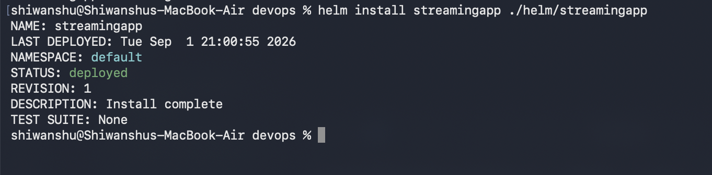

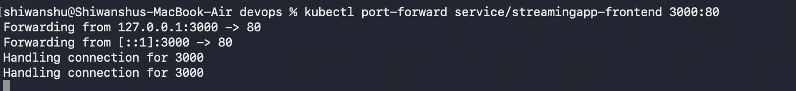


---

## Step 3 — AWS Environment Setup

**Goal:** Install and configure the AWS CLI with personal AWS credentials, ready for everything downstream (ECR, EKS, CloudWatch, SNS).

```bash
aws --version
# aws-cli/2.36.19

aws sts get-caller-identity     # confirms the CLI is authenticated
aws configure get region        # ap-south-1
```

AWS credentials were configured via `aws configure` and were **never committed to GitHub** — this is a hard rule followed throughout the project (see [Section 16](#16-validation-checklist)). All region-specific resources (ECR, EKS, CloudWatch, SNS) were created in **`ap-south-1` (Mumbai)**.

---

## Step 2b — Push Images to Amazon ECR

**Goal:** One dedicated ECR repository per component, with locally-built images pushed to each.

**1. Create a repository per component:**

```bash
for repo in streamingapp-frontend streamingapp-auth streamingapp-streaming streamingapp-admin streamingapp-chat; do
  aws ecr create-repository --repository-name "$repo" --region ap-south-1
done
```

**2. Authenticate Docker against ECR:**

```bash
aws ecr get-login-password --region ap-south-1 \
  | docker login --username AWS --password-stdin <ACCOUNT_ID>.dkr.ecr.ap-south-1.amazonaws.com
```

**3. Tag and push each image** (`ACCOUNT_ID` and registry values kept out of version control):

```bash
docker tag streamingapp-frontend:latest <ACCOUNT_ID>.dkr.ecr.ap-south-1.amazonaws.com/streamingapp-frontend:latest
docker push <ACCOUNT_ID>.dkr.ecr.ap-south-1.amazonaws.com/streamingapp-frontend:latest
# ...repeated for auth, streaming, admin, chat
```

All five repositories were verified via the AWS CLI and confirmed to contain their `latest` tag.

**📸 Proof:**

| # | Screenshot | What it shows |
|---|---|---|
| 9 | `Images/9.RepositoryCreated.png` | Five ECR repositories created |
| 10 | `Images/10.ImagePushedToRegistry.png` | Images successfully pushed to ECR |

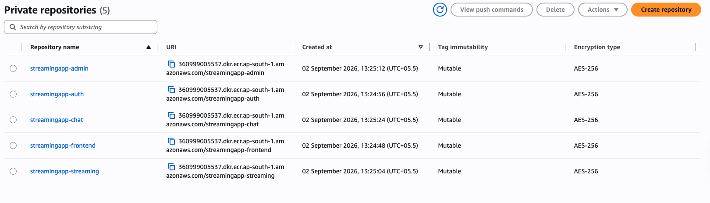
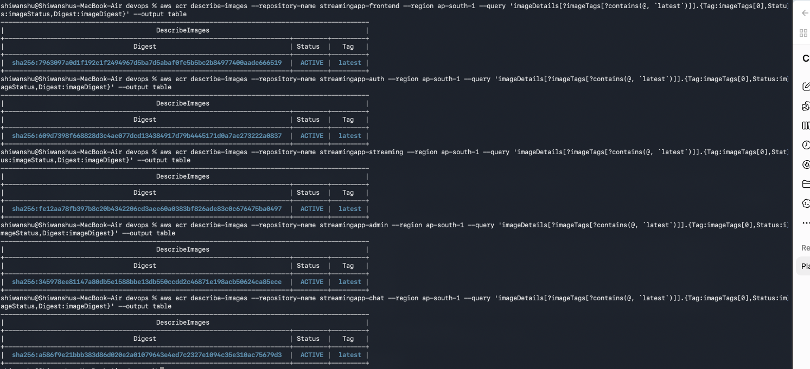

---

## Step 4 — Continuous Integration with Jenkins

**Goal:** Automate the build → ECR push cycle, triggered on every commit.

### 4.1 Jenkins Server Setup (on EC2)

An Ubuntu EC2 instance was provisioned and configured as the Jenkins host:

```bash
sudo apt update && sudo apt upgrade -y

# Java (Jenkins prerequisite)
sudo apt install fontconfig openjdk-21-jre -y
java -version

# Jenkins itself (via the official apt repo)
sudo apt install jenkins -y
sudo systemctl enable --now jenkins
sudo systemctl status jenkins        # listening on :8080
```

Jenkins was reached at `http://<EC2_PUBLIC_IP>:8080`, unlocked, suggested plugins installed, and an admin account created.

### 4.2 Giving Jenkins the Tools It Needs

Jenkins needs to build Docker images and talk to AWS, so those tools were installed directly on the EC2 host:

```bash
sudo apt install git docker.io -y
sudo systemctl enable --now docker

# Let the jenkins user run docker commands
sudo usermod -aG docker jenkins
sudo systemctl restart jenkins
sudo -u jenkins docker ps            # confirms Jenkins can reach the Docker daemon
```

AWS CLI (x86_64 build, matching the EC2 architecture), `kubectl`, `helm`, and `eksctl` were also installed on the same box so the pipeline could deploy straight to EKS later.

### 4.3 Jenkins Credentials

Using the **AWS Credentials plugin**, an AWS credential was added in Jenkins:

- **ID:** `aws-ecr`
- **Description:** AWS credentials for ECR
- Used by the pipeline to authenticate with ECR — **never hard-coded into the Jenkinsfile.**

### 4.4 The Pipeline (`StreamingApp-CI-CD`)

A declarative Jenkins pipeline job runs the following stages on every trigger:

```
Checkout  →  Build Docker Images  →  Login to ECR  →  Tag Images
   →  Push Images to ECR  →  Configure EKS Access  →  Deploy with Helm
   →  Verify Deployment  →  Send SNS Notification
```

- **Checkout:** pulls the `feature/devops` branch from `github.com/shiwanshu97/StreamingApp`.
- **Build:** builds all five Docker images using their respective Dockerfiles.
- **ECR Login/Tag/Push:** authenticates with `aws ecr get-login-password`, tags images with the **Jenkins build number** (e.g. `streamingapp-auth:6`) instead of a static `latest` — this gives every deployment a traceable, versioned image.
- **EKS Access:** runs `aws eks update-kubeconfig --region ap-south-1 --name streamingapp-eks` so `kubectl`/`helm` can reach the cluster.
- **Helm Deploy:** `helm upgrade --install`, explicitly overriding both the image **repository** and **tag** per service (see [Section 14](#14-issue-faced--resolution) for why both matter).
- **Verify:** waits for the Kubernetes rollout (`--wait --timeout 10m`) before declaring success.
- **Notify:** publishes a success/failure message to SNS (see [Step 9](#step-9-bonus--chatops-with-amazon-sns)).

### 4.5 Automatic Triggering via GitHub Webhook

A webhook was added on the GitHub repo pointing at:

```
http://<JENKINS_PUBLIC_IP>:8080/github-webhook/
```

configured for `Content-Type: application/json` and **Push events**. Jenkins' job trigger was set to **"GitHub hook trigger for GITScm polling."**

**Verification:** a real commit was pushed to `feature/devops`. Jenkins picked it up automatically (`Started by GitHub push by shiwanshu97`), ran the full pipeline, and finished with `SUCCESS` — proving the webhook doesn't just deliver (`HTTP 200`), it actually fires the build.

**📸 Proof:**

| # | Screenshot | What it shows |
|---|---|---|
| 11 | `Images/11.ExampleThatImagesArePushedToECRByJenkinsPipeline.png` | Jenkins-built, versioned images landing in ECR |
| 13 | `Images/13.Streaming-App-EC2-server-Created.png` | Jenkins EC2 instance provisioned and running |

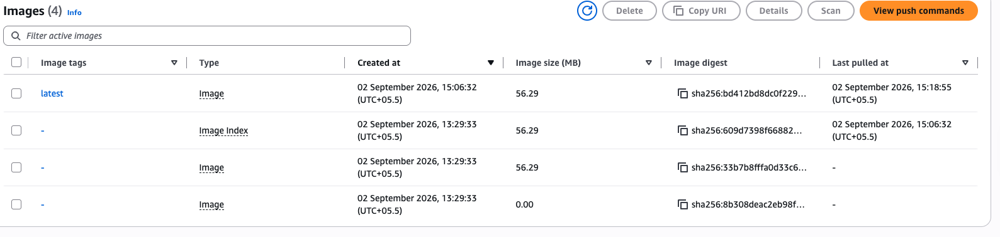
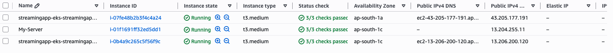

---

## Step 5 — Kubernetes Deployment on Amazon EKS

### 5.1 Provisioning the Cluster

```bash
eksctl create cluster \
  --name streamingapp-eks \
  --region ap-south-1 \
  --nodegroup-name streamingapp-nodes \
  --node-type t3.medium \
  --nodes 2 \
  --nodes-min 1 \
  --nodes-max 3 \
  --managed
```

| Setting | Value |
|---|---|
| Cluster name | `streamingapp-eks` |
| Region | `ap-south-1` |
| Kubernetes version | 1.34 |
| Node group | `streamingapp-nodes` (managed) |
| Instance type | `t3.medium` |
| Nodes | 2 initial (autoscaling 1–3) |

```bash
kubectl get nodes           # both nodes: Ready
kubectl get pods -A         # VPC CNI, CoreDNS, kube-proxy, metrics-server all Running
```

### 5.2 Pointing Helm at ECR

`helm/streamingapp/values.yaml` was updated so every service's image points at its ECR repository instead of a local tag:

```yaml
images:
  frontend:  { repository: <ECR_REGISTRY>/streamingapp-frontend,  tag: latest }
  auth:      { repository: <ECR_REGISTRY>/streamingapp-auth,      tag: latest }
  streaming: { repository: <ECR_REGISTRY>/streamingapp-streaming, tag: latest }
  admin:     { repository: <ECR_REGISTRY>/streamingapp-admin,     tag: latest }
  chat:      { repository: <ECR_REGISTRY>/streamingapp-chat,      tag: latest }
```

referenced in each Deployment template as:

```yaml
image: "{{ .Values.images.auth.repository }}:{{ .Values.images.auth.tag }}"
```

— which is what lets Jenkins deploy a brand-new image tag on every single build, no manual chart edits required.

### 5.3 Deploying

```bash
helm upgrade --install streamingapp ./helm/streamingapp \
  --set images.frontend.tag=$BUILD_NUMBER \
  --set images.auth.tag=$BUILD_NUMBER \
  --set images.streaming.tag=$BUILD_NUMBER \
  --set images.admin.tag=$BUILD_NUMBER \
  --set images.chat.tag=$BUILD_NUMBER \
  --wait --timeout 10m
```

```bash
kubectl get pods        # all 6 workloads → Running
kubectl get svc          # frontend exposed via NodePort :30200
kubectl get endpoints    # confirms Services are routing to healthy pods
```

### 5.4 Exposing the Frontend

The frontend `Service` is `NodePort`, bound to port `30200`. Initially this wasn't reachable externally — the EKS **worker-node security group** had no inbound rule for that port. Fixed by adding:

```
Protocol: TCP | Port: 30200 | Source: 0.0.0.0/0
```

```bash
curl -I --connect-timeout 10 http://<EKS_NODE_PUBLIC_IP>:30200
# HTTP/1.1 200 OK
```

### 5.5 Backend Health Check on EKS

```bash
kubectl exec deploy/streamingapp-auth -- wget -qO- http://localhost:3001/health
# {"status":"OK"}
```

**📸 Proof:**

| # | Screenshot | What it shows |
|---|---|---|
| 12 | `Images/12.EKS-Cluster-Created.png` | EKS cluster + node group provisioned |
| 14 | `Images/14.InstallationThroughHelm.png` | `helm upgrade --install` deploying to EKS |
| 15 | `Images/15.SuccessfullyDeployedOnEc2.png` | Deployment landing successfully on the cluster's EC2 worker nodes |
| 16 | `Images/16.AllPods&ServicesRunning.png` | All 6 pods and services `Running` on EKS |
| 17 | `Images/17.HealthCheck & Endpoints.png` | Backend health checks + Service endpoints verified |

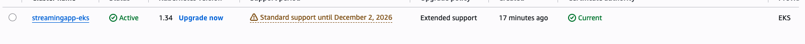
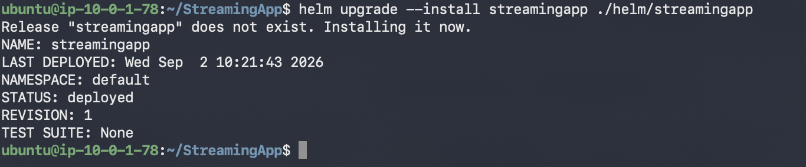
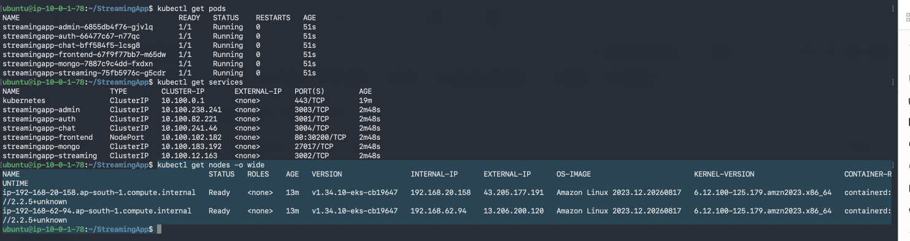


---

## Step 6 — Monitoring & Logging with CloudWatch

### 6.1 Enable CloudWatch Observability

The managed **Amazon CloudWatch Observability** add-on was installed on the EKS cluster — this bundles the CloudWatch Agent and Fluent Bit as DaemonSets, so no manual manifests were needed:

```bash
aws eks create-addon \
  --cluster-name streamingapp-eks \
  --addon-name amazon-cloudwatch-observability \
  --addon-version v6.6.0-eksbuild.1 \
  --region ap-south-1

aws eks describe-addon \
  --cluster-name streamingapp-eks \
  --addon-name amazon-cloudwatch-observability \
  --region ap-south-1 --query 'addon.status' --output text
# ACTIVE
```

```bash
kubectl get pods -n amazon-cloudwatch
# cloudwatch-agent (x2), fluent-bit (x2), observability-controller-manager
```

### 6.2 IAM Fix for Fluent Bit

Fluent Bit initially failed with `AccessDeniedException` trying to create log streams. Root cause: the EKS node IAM role was missing CloudWatch permissions. Fixed by attaching the AWS-managed policy:

```
CloudWatchAgentServerPolicy  →  attached to the EKS node group IAM role
```

then restarting the DaemonSet:

```bash
kubectl rollout restart daemonset/fluent-bit -n amazon-cloudwatch
```

### 6.3 Centralized Logs

Container Insights creates one log group per data type:

```
/aws/containerinsights/streamingapp-eks/application
/aws/containerinsights/streamingapp-eks/dataplane
/aws/containerinsights/streamingapp-eks/host
/aws/containerinsights/streamingapp-eks/performance
```

```bash
aws logs describe-log-groups --region ap-south-1 \
  --query 'logGroups[].logGroupName' --output table
```

All pod logs (including MongoDB) were confirmed searchable under the `application` log group.

### 6.4 Metrics

```bash
aws cloudwatch list-metrics --namespace ContainerInsights --region ap-south-1
```

Container Insights metrics (`pod_number_of_containers`, `container_memory_request`, etc.) were confirmed flowing in, dimensioned by cluster/namespace/pod/container.

### 6.5 CloudWatch Alarm

A CPU-utilization alarm was created against the cluster:

```bash
aws cloudwatch put-metric-alarm \
  --alarm-name StreamingApp-EKS-High-CPU \
  --alarm-description "Alarm when EKS cluster CPU utilization is high" \
  --namespace AWS/EKS \
  --metric-name cluster_node_cpu_utilization \
  --dimensions Name=ClusterName,Value=streamingapp-eks \
  --statistic Average --period 300 --evaluation-periods 1 \
  --threshold 80 --comparison-operator GreaterThanThreshold \
  --treat-missing-data notBreaching \
  --region ap-south-1
```

Initial state was `INSUFFICIENT_DATA`, which is expected and clears once enough datapoints accumulate.

**📸 Proof:**

| # | Screenshot | What it shows |
|---|---|---|
| 19 | `Images/19.CloudwatchLog-Pods.png` | Pod-level logs flowing into CloudWatch |
| 20 | `Images/20.Cloudwatch-Log-Genereating-Ec2-Machine.png` | Logs being generated on the underlying EC2/worker nodes |
| 21 | `Images/21.Cloudwatch-Log-Genereating-AWS-Cloudwatch-UI.png` | Logs visible in the CloudWatch console |
| 22 | `Images/22.Cloudwatch-Log-Verified.png` | Log group/stream verification |
| 23 | `Images/23.Cloudwatch-Alarm.png` | The `StreamingApp-EKS-High-CPU` alarm configured in CloudWatch |

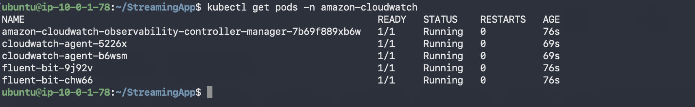
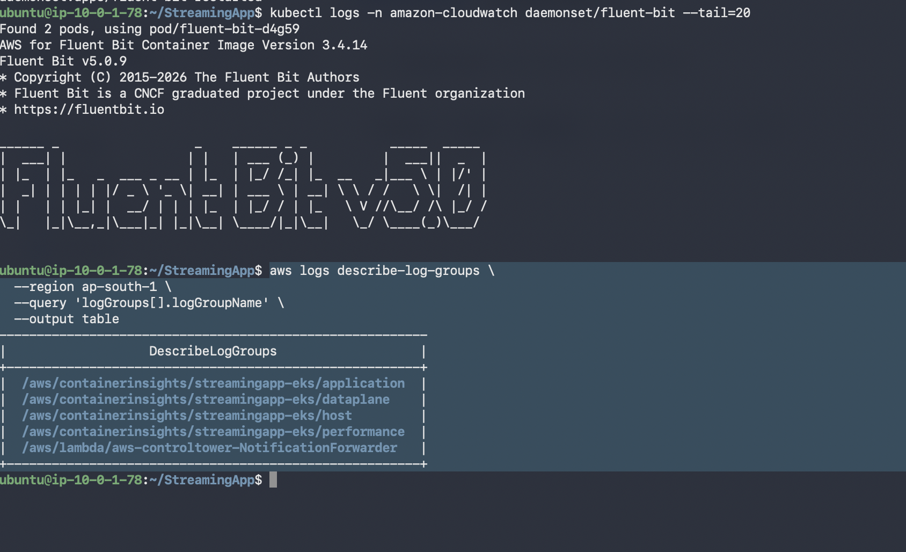
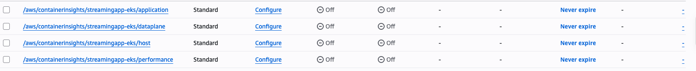
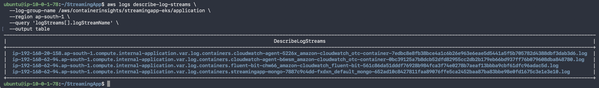
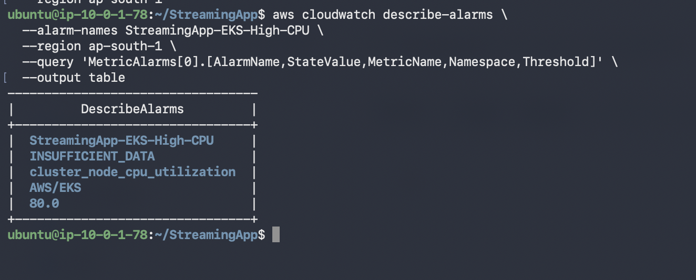

---

## Step 8 — Scaling & Final Validation

### 8.1 Horizontal Scaling

The frontend deployment was scaled up to prove the app stays healthy under scaling operations:

```bash
kubectl scale deployment streamingapp-frontend --replicas=3
kubectl get deployment streamingapp-frontend
```

```
READY        3/3
UP-TO-DATE   3
AVAILABLE    3
```

All three replicas came up with **0 restarts**, spread across both EKS worker nodes — confirming the app handles horizontal scale-out cleanly.

### 8.2 Final End-to-End Validation

```bash
kubectl get pods -o wide
kubectl rollout status deployment/streamingapp-frontend
kubectl rollout status deployment/streamingapp-auth
kubectl rollout status deployment/streamingapp-streaming
kubectl rollout status deployment/streamingapp-admin
kubectl rollout status deployment/streamingapp-chat
```

Final state:

```
Admin       1/1 Running
Auth        1/1 Running
Chat        1/1 Running
Frontend    3/3 Running
MongoDB     1/1 Running
Streaming   1/1 Running
```

Frontend confirmed externally reachable (`curl -I` → `200 OK`), backend confirmed healthy via `kubectl exec` health checks, and all Kubernetes Service endpoints confirmed populated.

**📸 Proof:**

| # | Screenshot | What it shows |
|---|---|---|
| 18 | `Images/18.ScaledReplicaUsingHelm.png` | Frontend scaled to 3/3 replicas |
| 24 | `Images/24.Final-Validation.png` | Final full-stack validation — all pods/services healthy |

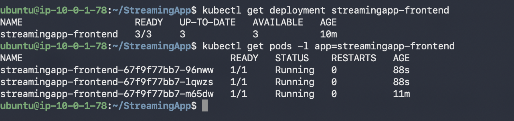
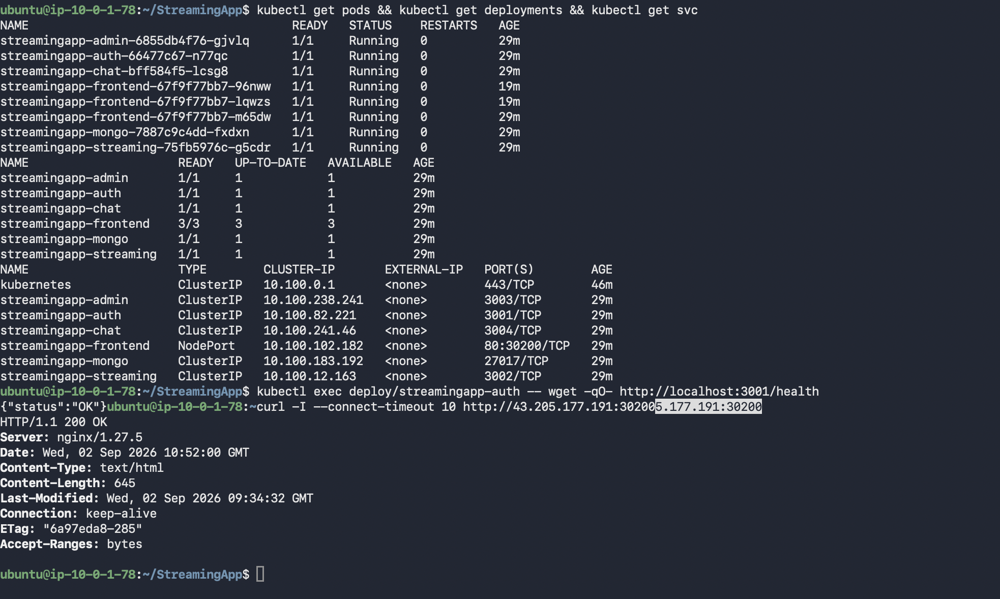

---

## Step 9 (Bonus) — ChatOps with Amazon SNS

**Goal:** Real-time deployment notifications, wired directly into the Jenkins pipeline.

**1. SNS Topics:**

```
StreamingApp-Deployment-Events     (deployment success)
StreamingApp-Pipeline-Failures     (deployment failure)
```

An email subscription was added to the deployment-events topic and confirmed.

**2. Manual test:**

```bash
aws sns publish \
  --topic-arn "<DEPLOYMENT_TOPIC_ARN>" \
  --subject "StreamingApp Deployment Test" \
  --message "StreamingApp deployment notification test from AWS SNS." \
  --region ap-south-1
```

**3. Jenkins integration:** the pipeline's `post { success { ... } }` block publishes to the success topic with the Jenkins job name, build number, build URL, EKS cluster, Helm release, image tag, and region. The `post { failure { ... } }` block does the same against the failure topic.

```
Successful Pipeline → SNS (Deployment Events) → Email
Failed Pipeline      → SNS (Pipeline Failures) → Email
```

**📸 Proof:**

| # | Screenshot | What it shows |
|---|---|---|
| 25 | `Images/25.Deployment-Failure-Notification.png` | Failure notification received via email/SNS |
| 26 | `Images/26.Deployment-Success-Notification.png` | Success notification received via email/SNS |

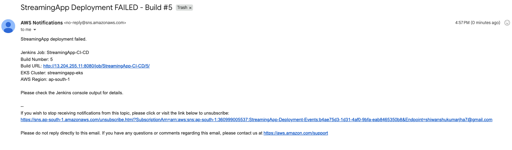
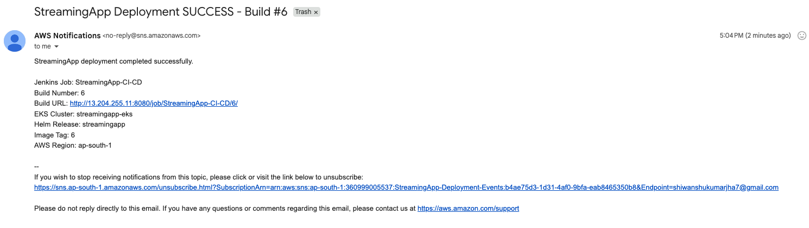

---

## 14. Issue Faced & Resolution

**Symptom (Build #5):** Helm deployment failed with:

```
UPGRADE FAILED: context deadline exceeded
```

and pods were stuck in:

```
ImagePullBackOff
```

**Investigation:** Kubernetes was trying to pull `docker.io/library/streamingapp-auth:5` — a **Docker Hub** path — instead of the ECR image. The Helm templates correctly referenced `.Values.images.<service>.repository` and `.tag`, but the Jenkins pipeline was **only overriding the tag**, not the repository — so Helm silently fell back to the chart's default repository value (Docker Hub).

**Fix:**
1. Updated the Jenkins `helm upgrade` command to explicitly pass **both** `--set images.<service>.repository=$ECR_REGISTRY/streamingapp-<service>` **and** `--set images.<service>.tag=$BUILD_NUMBER` for every service.
2. Corrected the Helm wait timeout, which had accidentally been set to `10s` instead of `10m` (nowhere near enough time for pods to pull images and become ready).

**Result:** Build #6 completed successfully — `helm upgrade` reported `STATUS: deployed`, all pods reached `1/1 Running`, and Jenkins finished with `SUCCESS`.

> **Lesson:** When a Helm chart parameterizes both an image repository *and* tag, a CI pipeline must override both explicitly — overriding only the tag lets the chart's default repository silently win.

---

## 15. Useful Command Reference

**Kubernetes**
```bash
kubectl get nodes -o wide
kubectl get pods -o wide
kubectl get deployments
kubectl get svc
kubectl get endpoints
kubectl exec deploy/streamingapp-auth -- wget -qO- http://localhost:3001/health
kubectl scale deployment streamingapp-frontend --replicas=3
```

**Helm**
```bash
helm lint ./helm/streamingapp
helm template streamingapp ./helm/streamingapp
helm install streamingapp ./helm/streamingapp
helm upgrade --install streamingapp ./helm/streamingapp
helm list
helm history streamingapp
helm rollback streamingapp <REVISION>
```

**EKS**
```bash
eksctl create cluster --name streamingapp-eks --region ap-south-1 ...
aws eks update-kubeconfig --region ap-south-1 --name streamingapp-eks
```

**ECR**
```bash
aws ecr describe-repositories --region ap-south-1
aws ecr get-login-password --region ap-south-1 | docker login --username AWS --password-stdin <ECR_REGISTRY>
```

**CloudWatch**
```bash
aws eks describe-addon --cluster-name streamingapp-eks --addon-name amazon-cloudwatch-observability --region ap-south-1
aws logs describe-log-groups --region ap-south-1 --query 'logGroups[].logGroupName' --output table
aws cloudwatch list-metrics --namespace ContainerInsights --region ap-south-1
```

**Frontend / Backend Validation**
```bash
curl -I http://<EKS_NODE_PUBLIC_IP>:30200
kubectl exec deploy/streamingapp-auth -- wget -qO- http://localhost:3001/health
```

---

## 16. Validation Checklist

| Requirement | Status |
|---|:---:|
| Repo forked & synced with upstream | ✅ |
| Dockerfiles for frontend + all backend services | ✅ |
| Docker images built and tested locally | ✅ |
| Local validation on Kind + Helm | ✅ |
| AWS CLI installed & configured | ✅ |
| Dedicated ECR repo per component | ✅ |
| Images pushed to ECR | ✅ |
| Jenkins installed on EC2 | ✅ |
| Jenkins plugins & credentials configured | ✅ |
| Jenkins pipeline builds + pushes to ECR | ✅ |
| Pipeline auto-triggers on commit (GitHub webhook) | ✅ |
| EKS cluster provisioned via `eksctl` | ✅ |
| MERN stack packaged as a Helm chart | ✅ |
| Deployed to EKS via Helm | ✅ |
| CloudWatch metrics + alarms configured | ✅ |
| Centralized logging via CloudWatch Logs | ✅ |
| Architecture + deployment documentation | ✅ |
| Frontend & backend verified functional/reachable | ✅ |
| Scaling verified (frontend → 3 replicas, 0 restarts) | ✅ |
| **Bonus:** SNS topics + Slack/Teams/Telegram or email alerts | ✅ |

---

## 17. Image In The Sequence


## 18. Conclusion

StreamingApp went from a set of local Node/React services to a fully automated, monitored, cloud-native deployment:

```
Docker → GitHub → Jenkins → Amazon ECR → Amazon EKS → Helm → CloudWatch → Amazon SNS
```

A single `git push` to `feature/devops` now triggers the entire pipeline — build, containerize, publish, deploy, verify, and notify — end-to-end, with no manual steps in between. The application is live on a multi-node EKS cluster, horizontally scaled, observable through CloudWatch, and alerting on both deployment outcomes and cluster health.

**Repository:** [github.com/shiwanshu97/StreamingApp](https://github.com/shiwanshu97/StreamingApp) — branch `feature/devops`
